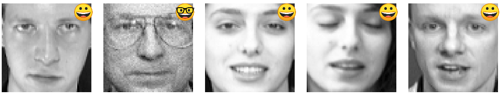

# Olivetti Glasses Detector 🕶️

### Overview

This project focuses on detecting whether individuals in the Olivetti Faces dataset are wearing glasses using machine learning techniques. It involves loading the dataset, performing data augmentation to balance the classes, applying Principal Component Analysis (PCA) for dimensionality reduction, training a Support Vector Machine (SVM) model, and evaluating its performance. The goal is to accurately classify images into two categories: with glasses and without glasses, while visualizing the results with emojis for better interpretability.

<div align="center">
    
    <p>Sample predictions with emojis indicating glasses (🕶️) or no glasses (🙈).</p>
</div>

**Data Source**: The project uses the [Olivetti Faces Dataset](https://scikit-learn.org/stable/modules/generated/sklearn.datasets.fetch_olivetti_faces.html), which contains 400 grayscale images of faces from 40 distinct subjects. The dataset is preprocessed to label images based on whether the individuals are wearing glasses, as identified in *Learning scikit-learn: Machine Learning in Python* by Garreta and Moncecchi (2013).

## Table of Contents
- [Project Features](#project-features)
- [Project Architecture](#project-architecture)
- [Technologies Used](#technologies-used)
- [Running the Application](#running-the-application)
- [Project Structure](#project-structure)
- [Contact](#contact)

## Project Features

- **Class Imbalance Handling**: Balances the dataset (281 without glasses vs. 119 with glasses) using data augmentation techniques like rotation, flipping, noise addition, and brightness adjustment.
- **Dimensionality Reduction**: Applies PCA to reduce the dimensionality of the images from 4096 features to 150 components, preserving 95% of the variance.
- **Model Training**: Uses a Pipeline with PCA and SVM, optimized via GridSearchCV to find the best hyperparameters for classification.
- **Evaluation and Visualization**: Provides detailed evaluation metrics (classification report, confusion matrix) and visualizes predictions with emojis to indicate the presence or absence of glasses.
- **Interactive Visualizations**: Includes 2D and 3D PCA projections using Matplotlib and Plotly to explore the data.

## Project Architecture

Below is the high-level architecture of the project, including data loading, preprocessing, augmentation, model training, and visualization stages.

1. **Data Loading**: Fetches the Olivetti Faces dataset using `sklearn.datasets.fetch_olivetti_faces` and creates binary labels (glasses/no glasses) based on predefined ranges.
2. **Data Augmentation**: Applies transformations (rotation, flipping, noise, brightness) to the minority class (with glasses) to balance the dataset.
3. **Dimensionality Reduction**: Uses PCA to reduce the feature space, followed by 2D/3D visualizations to explore class separability.
4. **Model Training**: Trains an SVM model within a Pipeline, optimizing hyperparameters using GridSearchCV.
5. **Evaluation**: Evaluates the model using a classification report and confusion matrix.
6. **Results Visualization**: Displays sample predictions with emojis indicating glasses or no glasses.

## Technologies Used

- **Python**: Core programming language (version 3.8+ recommended).
- **NumPy**: For numerical computations and array operations.
- **Matplotlib**: For plotting and visualizing results (e.g., PCA variance, confusion matrix).
- **Plotly**: For interactive 3D visualizations of PCA projections.
- **Scikit-learn**: For machine learning tasks (data loading, PCA, SVM, GridSearchCV, metrics).
- **Scikit-image**: For data augmentation (rotation, flipping, noise, brightness adjustments).

## Running the Application

1. **Clone the Repository**:
   - First, clone the repository to your local machine:
     ```bash
     git clone https://github.com/Carlos93U/olivetti_glasses_detector.git
     cd olivetti_glasses_detector
     ```

2. **Create and Activate Virtual Environment**:
   - It is recommended to create a virtual environment to manage the dependencies:
     ```bash
     python -m venv env
     source env/bin/activate  # Linux/Mac
     .\env\Scripts\activate   # Windows
     ```

3. **Install Dependencies**:
   - Install the required dependencies using the provided `requirements.txt`:
     ```bash
     pip install -r requirements.txt
     ```
   The `requirements.txt` includes:
   - `numpy==2.2.5`
   - `matplotlib==3.10.3`
   - `plotly==6.0.1`
   - `scikit-learn==1.6.1`
   - `scikit-image==0.25.2`

4. **Run the Jupyter Notebook**:
   - Launch Jupyter Notebook and open the main notebook:
     ```bash
     jupyter notebook
     ```
   - In the Jupyter interface, navigate to `notebooks/SVC_glasses.ipynb` and run all cells to execute the full pipeline, from data loading to visualization.

5. **Ensure Emoji Images are Present**:
   - The notebook uses `glass.png` and `no_glasses.png` for visualization. Ensure these files are in the project root directory, or update the notebook to handle missing files gracefully.

## Project Structure

The following is an overview of the main folders and files within the project.

```plaintext
olivetti_glasses_detector/
├── docs/images/faces           # Sample predictions with emojis
├── notebooks/                  # Jupyter notebooks for the project
│   ├── SVC_glasses.ipynb       # Main notebook with the full pipeline
│   ├── glass.png               # Emoji image for "with glasses"
│   ├── no_glasses.png          # Emoji image for "without glasses"
├── .gitignore                  # Git ignore file
├── requirements.txt            # Project dependencies
└── README.md                   # Project documentation
```

## Contact

For any questions or feedback, please contact:

**Juan C. Huillcas**  
Email: [huillcas.juan3@gmail.com](mailto:huillcas.juan3@gmail.com)  
LinkedIn: [Juan C. Huillcas](https://www.linkedin.com/in/juan-carlos-huillcas)  
